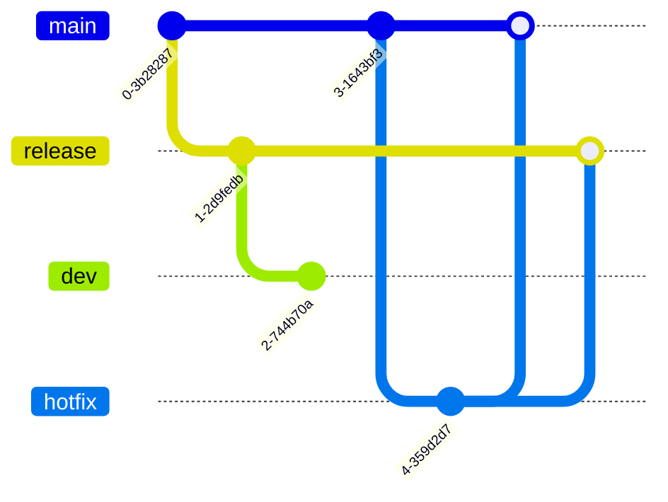

<p align="center">
    <a href="https://www.flixxo.com" target="_blank">
        
    </a>
</p>

## Indice

- <a href="#project">About the Project</a>
- <a href="#technologies">Technologies</a>
- <a href="#installation">Installation</a>
- <a href="#config">Configuration</a>
- <a href="#branches">How to use the branches</a>

## About the Project <a name="project"></a>

`Flixxo challenge` is the Api for `Flixxo`

## Technologies <a name="technologies"></a>

[![NodeJs][nodejs.org]][node-url] [![Express][express.com]][express-url] [![Typescript][typescript.org]][typescript-url]

## Installation <a name="installation"></a>

1. Clone your repository locally.

```bash
git clone + link de SSH o HTTPS
```

2. Install dependencies [NPM](https://www.npmjs.com/ 'https://www.npmjs.com/').

```bash
npm install
```

## Configuration <a name="config"></a>

1. Create the database.
2. Set up the database in `.env`
3. Run the migrations within the project path.

```bash
npm run migration:run
```

4. Generate the seeds with the default administrator user.

```bash
npm run db:seed:all
```

5. Start the server:

```bash
npm run dev
```

Then visit `http://localhost:8000/api-docs` to view the documentation page.

## How to use the branches <a name="branches"></a>

The organization of the branches consists of:

- dev
- release
- main

This is the normal flow of the branches:


Para realizar un hotfix:



<!-- For tags -->
<!-- https://www.markdownguide.org/basic-syntax/#reference-style-links -->

[nodejs.org]: https://img.shields.io/badge/NodeJS-brightgreen?style=for-the-badge&logo=node.js&logoColor=white
[node-url]: https://nodejs.org
[express.com]: https://img.shields.io/badge/Express-white?style=for-the-badge&logo=express&logoColor=black
[express-url]: https://expressjs.com/
[typescript.org]: https://img.shields.io/badge/Typescript-blue?style=for-the-badge&logo=typescript&logoColor=white
[typescript-url]: https://www.typescriptlang.org/
