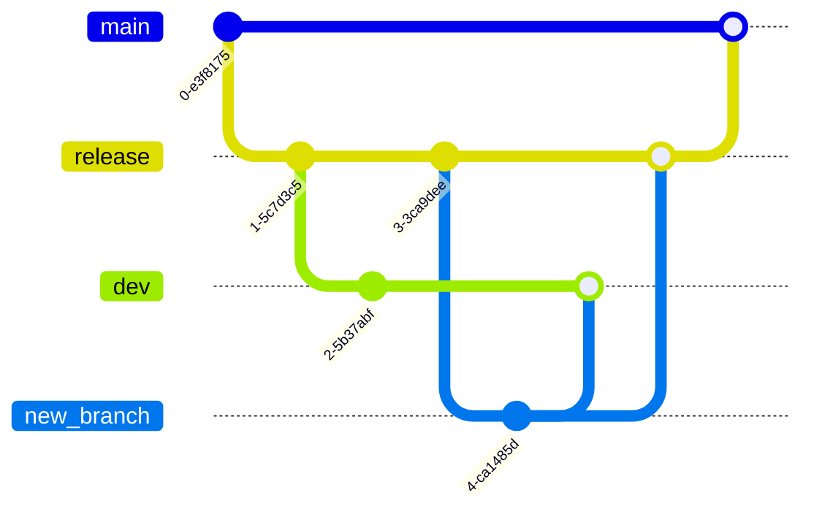

<p align="center">
    <a href="https://www.flixxo.com" target="_blank">
        
    </a>
</p>

## Index

- <a href="#project">About the Project</a>
- <a href="#technologies">Technologies</a>
- <a href="#installation">Installation</a>
- <a href="#config">Configuration</a>
- <a href="#branches">How to use the branches</a>
- <a href="#questions">Challenge questions</a>

## About the Project <a name="project"></a>

`Flixxo challenge` is an API for managing cryptos/tokens and their historical prices.

## Technologies <a name="technologies"></a>

[![NodeJs][nodejs.org]][node-url] [![Express][express.com]][express-url] [![Typescript][typescript.org]][typescript-url]

For the hosting we used `Render`, in a free plan, the only limitation is that if it is not used after 15 minutes the server shuts down, the first query after that takes longer to perform, but then it works normally.
`JawsDB`, a free service provided by AWS, was used for the database.
`Swagger` for documentation.

## Installation <a name="installation"></a>

1. Clone your repository locally.

```bash
git clone + link SSH / HTTPS
```

2. Install dependencies [NPM](https://www.npmjs.com/ 'https://www.npmjs.com/').

```bash
npm install
```

## Configuration <a name="config"></a>

1. Create the database.
2. Set up the database in `.env`
3. Run the migrations within the project path.

```bash
npm run migration:run
```

4. Test data will be generated for testing, the test user and password can be found in the documentation in the login section.

5. Start the server:

```bash
npm run dev
```

Then visit `https://flixxo-challenge.onrender.com/api-docs/` to view the documentation page.

## How to use the branches <a name="branches"></a>

The organization of the branches consists of:

- dev
- release
- main

This is the normal flow of the branches:



## Challenge questions <a name="questions"></a>

What is SQL Injection and how can it be avoided?

```bash
SQL injection is a way of attacking the database, making it vulnerable in order to alter the data inside it.
Using ORMs such as TYPEORM, SEQUELIZE and middlewares such as Express-Validator prevents the user from entering sql code to modify the database.
```

When is it convenient to use SQL Transactions? Give an example.

```bash
SQL Transactions is convenient to use to be able to go back in time when interacting with the database.
a particular case, a purchase in an ecommerce, the order data related to a user is saved, but until the purchase is not completed it is not sure that the saved data will be useful for the future, in case the buyer has canceled the purchase, a rollback can be made to cancel the purchase data.
```

Briefly describe the advantages of the controller/service/repository pattern.

```bash
The controller is only in charge of providing functionalities, the repository communicates with the database and the service is in charge of the commerce logic,
this allows to maintain a clean code and an organized structure.
```

What is the best way to store an enum type field in the DB?

```bash
Generating an array containing the possible results to that field, having the possibility to save that array in another table to list the possible options.
```

Using async/await: how to take advantage of parallelism?

```bash
Using queue, an example of this is the use of queues in the optimization of an image, in the controller, the information of an image is stored using async and await, while in a queue the image is sent to optimize the weight for storage.
```

[nodejs.org]: https://img.shields.io/badge/NodeJS-brightgreen?style=for-the-badge&logo=node.js&logoColor=white
[node-url]: https://nodejs.org
[express.com]: https://img.shields.io/badge/Express-white?style=for-the-badge&logo=express&logoColor=black
[express-url]: https://expressjs.com/
[typescript.org]: https://img.shields.io/badge/Typescript-blue?style=for-the-badge&logo=typescript&logoColor=white
[typescript-url]: https://www.typescriptlang.org/
